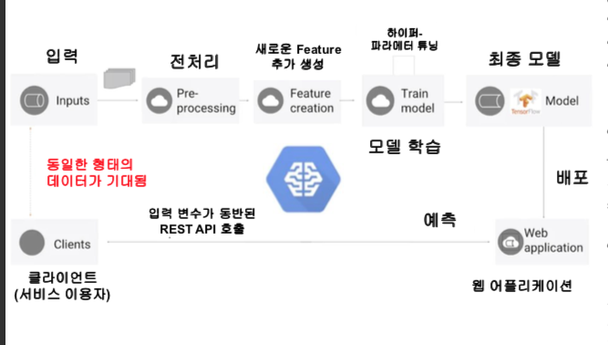
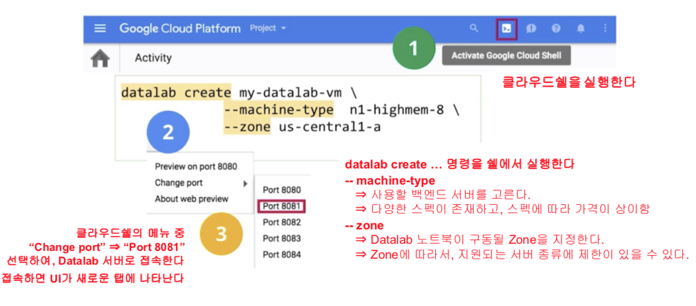
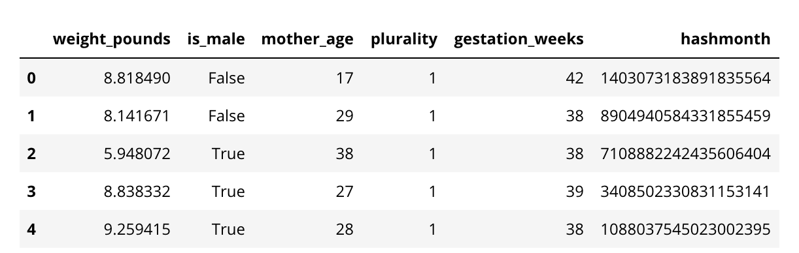
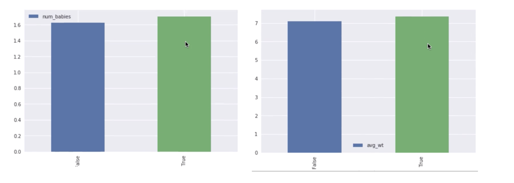
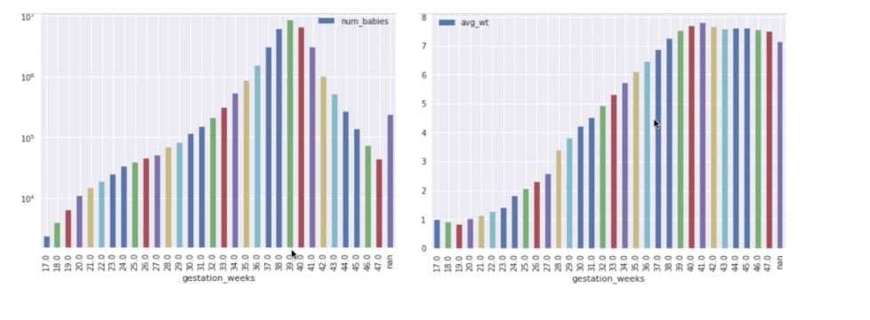
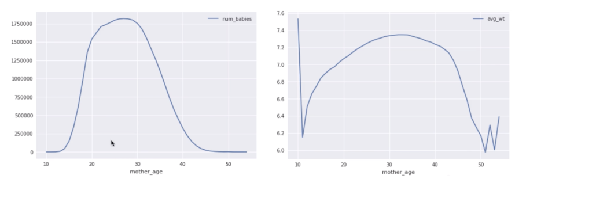
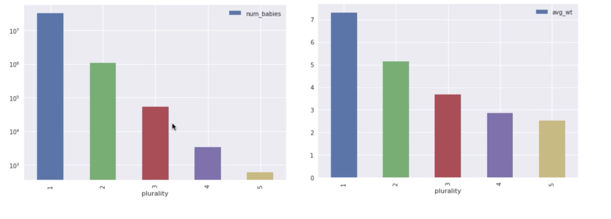

# ML in GCP And Explore the Data

## Machine Learning in GCP

- 텐서플로우 특징
    - 빅데이터를 제공, CPU/GCP/TPC등 가리지 않고 모든 환경에서 동작
    - 다양한 종류의 Feature Engeniering 제공
    - 많은 형태의 구현된 모델을 제공
- 하이퍼 파라미터
    - 모델의 학습이 수행되기 전에 정해지는 변수를 의미. 크게 모델과 학습으로 나뉨
    - NN예로 들면 각 계층의 수, 레이어별 뉴런 수, 배치 사이즈, 학습률 등이 있을 수 있다.
- 모델 배포시 고려사항
    - 특정시간에 얼마나 많은 사용자 접속 허용?
        - 텐서플로우에서  배포된 모델 코드를 자동으로 스케일링
    - 단순 Raw 데이터를 모델에 사용가능한가?
        - 모델은 생성 당시에 변형된 데이터를 기준으로 학습을 수행했기 때문에 Raw 데이터 입력에 관해 가공 과정이 필요하다. 따라서 모델의 형태나 입력되는 데이터의 형태가 바뀔 때마다 둘 사이의 인터페이스를 맞춰주는 작업이 필요
        - 학습시에 확인된 성능이 100일 때, 동일한 모델을 배포했음에도 실 서비스에서는 100만큼의 성능이 나오지 않을 때 Training-Service Skew라고 부른다.
- CEML(Cloud ML Engine)은 모델에 대하여 반복가능, 자동 스케일링, 하이퍼 파라미터 튜닝 방법을 제시한다.
- 모델 학습 과정
    1. 주피터 노트북 환경을 제공하는 **Cloud Datalab** 서비스 이용
    2. **BigQuery**의 SQL 쿼리로 데이터 샘플링 및 **Dataframe으로 변환**
    3. EDA(Explanatory Data Analysis) 수행 및 Feture Engineering
    4. **Tenser Flow** 모델을 학습 및 성능향상 작업 수행
    5. 샘플링 데이터셋 학습 완료 후, 전체 거대한 데이터 셋에 대한 학습 진행
- Scale Out
    - GCP(Google Cloud Platform)에서 제공하는 **Serverless** 기술 활용
    - Cloud Dataflow를 활용하여 전처리작업을 여러 머신으로 스케일 아웃되어 수행 가능
    - Cloud Dataflow, Cloud Storage, Cloud ML Engine은 모두 Serverless 기술로 서비스 수행을 위해 **파이썬 코드만 작성**하여 사용

## BigQuery

- Serveless 데이터 창고, 오직 API call을 통해서 사용가능
- 대용량의 데이터를 몇 초만에 사용 할 수 있게 가능
- 테이블은 비정규화된 형식, 중첩 및 필드의 반복도 지원함으로 JSON을 지원 할 수 있다.
- 쿼리로 처리된 데이터 양에 기반하여 과금발생
- [https://bigquery.cloud.google.com/welcome](https://bigquery.cloud.google.com/welcome?pli=1)

## DataLab

- GCP 플랫폼 위에서 구동되는 주피터노트북 환경, BigQuery과 같은 동일 인프라에서 제공되는 환경에 복잡한 설정없이 접근 가능
- 내부적으로 사용되는 서버 하드웨어 선택 가능
- 실행방법

    

## 실습

### 1. Explorring natality dataset

    BUCKET = 's-gcp-e0392b812e46804f'
    PROJECT = 's-gcp-e0392b812e46804f'
    REGION = 'asia-south1-c'

    import os
    # 시스템 환경변수 설정
    os.environ['BUCKET'] = BUCKET
    os.environ['PROJECT'] = PROJECT
    os.environ['REGION'] = REGIO

    # 버킷이 존재하는지 체크, 없다면 버킷을 생성
    %%bash
    if ! gsutil ls | grep -q gs://${BUCKET}/; then
    	gsutil mb -l ${REGION} gs://${BUCKET}
    fi

### 2. Explore data

    # Create SQL query using natality data after the year 2000
    query = """
    SELECT
    weight_pounds,
    is_male,
    mother_age,
    plurality,
    gestation_weeks,
    ABS(FARM_FINGERPRINT(CONCAT(CAST(YEAR AS STRING), CAST(month AS STRING)))) AS hashmonth 
    FROM
    publicdata.samples.natality
    WHERE year > 2000
    """
    # CAST(YEAR AS STRING) : year 컬럼값을 문자열로 변환
    # CONCAT(A, B) : A,B 두 스트링을 하나로 합침
    # FARM_FINGERPRINT : 해시값을 생성

    from google.cloud import bigquery
    
    # query를 수행, 100개의 데이터만 가지고온다. 이후 df로 변환
    df = bigquery.Client().query(query + " LIMIT 100").to_dataframe()
    df.head()

### 3. Lab Task 1

Using the above code as an example, write a query to find the unique values for each of the columns and the count of those values for babies born after the year 2000. For example, we want to get these values:

    is_male    num_babies    avg_wt
    False    16245054    7.104715
     True    17026860    7.349797

This is important to ensure that we have enough examples of each data value, and to verify our hunch that the parameter has predictive value.

    # COUNT(1) 은 null 값이 포함되어 있지 않은 row의 수
    query = '''
    SELECT
    is_male,
    COUNT(1) AS num_babies,
    AVG(weight_pounds) AS avg_wt
    FROM
    publicdata.samples.natality
    WHERE
    year > 2000
    GROUP BY
    is_male
    '''
    # 
    df = bigquery.Client().query(query + " LIMIT 100").to_dataframe()
    df.head()

### 4. Lab Task2

Which factors seem to play a part in the baby's weight?

**Bonus:** Draw graphs to illustrate your conclusions

    # Python에서 제공하는 문자열 함수를 통해 변수를 쿼리문에 사용 할 수 있음
    # 특정 컬름을 기준으로 그룹핑하여 전체 row 수와 타켓변수의 평균을 구하는 함수
    def get_disinct_values(column_name):
    	query = '''
    SELECT
    	{0},
    	COUNT (1) AS num_babies,
    	AVG(weight_pounds) AS avg_wt
    FROM
    	publicdata.samples.natality
    WHERE
    	year > 2000
    GROUP BY
    	{0}
    '''.format(column_name)
    	return bq.Client().query(query).result().to_dataframe()	

    # 성별 평균 몸무게와 아기 수를 그래프로 출력, 그래프를 통해 남자의 수와 몸무게가 더 큼을 알 수 있다.
    df = get_disinct_values('is_male')
    df.plot(x='is_male', y='num_babies', kind='bar')
    df.plot(x='is_male', y='avg_wt', kind='bar')

    # 출력된 그래프를 통해 임신기간과 몸무게는 어느정도 비례증가하는 관계임을 파악 할 수 있다.
    # logy=True는 y값에 대해 log를 취한다는 의미이다.
    df = get_disinct_values('gestation_weeks')
    df = df.sort_values('gestation_weeks')
    df.plot(x='gestation_weeks', y='num_babies',logy=True kind='bar')
    df.plot(x='gestation_weeks', y='avg_wt', kind='bar')

    # 엄마의 나이가 30 까지는 아기의 무게가 증가하고 이후로는 감소함을 알 수 있다.
    df = get_disinct_values('mother_age')
    df = df.sort_values('mother_age')
    df.plot(x='mother_age', y='num_babies')
    df.plot(x='mother_age', y='avg_wt')

    # 쌍둥이의 수가 많을 수록 아기의 평균 무게는 줄어든다.
    df = get_disinct_values('plurality') # 쌍둥이
    df = df.sort_values('mother_age')
    df.plot(x='plurality', y='num_babies')
    df.plot(x='plurality', y='avg_wt')

